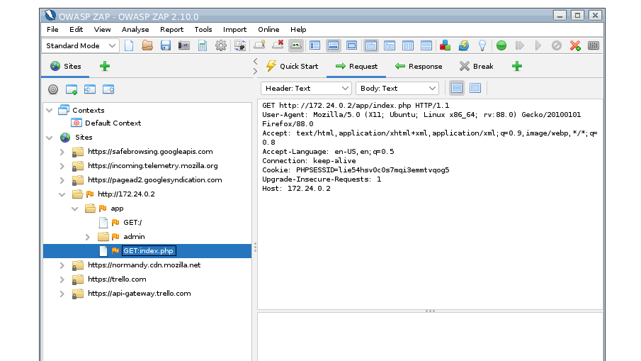

# Cookies

## Introduction
For a long time, cookies were the only option to **persistently store data on the client**, and it is still the prevailing solution.

Cookies are frequently used for **user identification**, e.g., at consecutive visits of a web application. Attacks based on cookie manipulation are called **cookie poisoning**.

## Cookie Types
Cookies can be persistent or non-persistent:
* **Persistent** cookies are stored on client's hard drive as long as their date is validated
* **Non-persistent** cookies are stored in RAM and are deleted when the web browser is closed

Moreover, cookies can be `secure` or `HttpOnly`:
* `secure` cookies are transmitted only via an HTTPS connection
* `HttpOnly` cookies are transmitted via HTTP or HTTPS, but cannot be accessed by JavaScript

## Storage and Manipulation
All web browsers store cookies in known file system locations and in known formats. An attacker can easily manipulate this data before it is used by a web application.

It is also possible to manipulate cookies **on the fly**, for example, using a tool like the ZAProxy.

Unlike with URL parameters, the attacker can also manipulate the date when the cookie expires, i.e., she can manipulate the cookie's lifetime.

In general, cookies can give you access to things like sessions, profiles, etc.

## Example
Web application under `https://www.weather.xyz` offers detailed weather information against payment. 

`https://www.weather.xyz` uses cookies that contain `userID` to identify users. The cookie is valid for the user's subscription period, e.g., a month.

Information stored in the cookie is processed by `https://www.weather.xyz` without additional authentication. 

This allows following 3 attacks:
* Attack 1: Eve manipulates `userID` to access `https://www.weather.xyz` as another user
* Attack 2: Eve extends their subscription by manipulating the cookie expiration date (by changing the Unix-timestamp in the cookie)
* Attack 3: cookies often store the number of failed login attempts. When they reach a specific threshold, say 5, `https://www.weather.xyz` deactivates that user account for 10 minutes to protect against brute force attacks. To bypass this, Eve sets the value of failed login attempts to 0 after each login attempt. Because she can automate this, she can trivially launch brute force attacks.

## Firefox
Here's cookies file in Firefox under Ubuntu Linux:
```shell
$ ls ~/.mozilla/firefox/3c4wnfog.default/cookies.sqlite
/home/paul/.mozilla/firefox/3c4wnfog.default/cookies.sqlite
```

You can use `sqlite3` to view the cookies:


```
sqlite> .tables
moz_cookies
sqlite> .schema moz_cookies
CREATE TABLE moz_cookies(id INTEGER PRIMARY KEY, originAttributes TEXT NOT NULL DEFAULT '', name TEXT, value TEXT, host TEXT, path TEXT, expiry INTEGER, lastAccessed INTEGER, creationTime INTEGER, isSecure INTEGER, isHttpOnly INTEGER, inBrowserElement INTEGER DEFAULT 0, sameSite INTEGER DEFAULT 0, rawSameSite INTEGER DEFAULT 0, CONSTRAINT moz_uniqueid UNIQUE (name, host, path, originAttributes));
sqlite>
sqlite> .headers ON
sqlite> .mode column
sqlite> select * from moz_cookies;
id          originAttributes  name        value                             host        path        expiry      lastAccessed      creationTime      isSecure    isHttpOnly  inBrowserElement  sameSite    rawSameSite
----------  ----------------  ----------  --------------------------------  ----------  ----------  ----------  ----------------  ----------------  ----------  ----------  ----------------  ----------  -----------

-- snip --

46267                         AMCV_EA76A  -894706358%7CMCIDTS%7C18212%7CMC  .office.co  /           1636660785  1633414111640000  1573502384810000  0           0           0                 0           0
127836                        TOptOut     1                                 .microsoft  /           1754379020  1633413930071000  1593086404120000  1           0           0                 0           0
144845                        _ga         GA1.2.1009283779.1533136493       .github.co  /           1663765118  1633413173313000  1533136492841000  0           0           0                 0           0
153757                        cookie-pre  analytics:accepted                .github.co  /           1633552460  1633413173313000  1602016475436000  1           0           0                 1           1
153902                        MicrosoftA  4bbe0f8b-2a0f-49bc-89d4-515d0b26  teams.micr  /dl/launch  1633673334  1633248526541000  1574409265001000  0           0           0                 0           0
153903                        MicrosoftA  2019-11-22T07:54:25.002Z          teams.micr  /dl/launch  1633673334  1633248526541000  1574409265001001  0           0           0                 0           0
167391                        MSFPC       GUID=791d6e95ab584dd0adfe95ea45f  docs.micro  /           1639236455  1631093593641000  1607700455670000  1           0           0                 0           0
220261                        MUIDB       1061410D31256B0D2D7B4F8F30906A26  teams.micr  /           1651385976  1633248526359000  1617689976073000  1           1           0                 0           0
220892                        MUID        008817A96F1467020D3A07BB6E276648  .office.co  /           1651477106  1633414111640000  1617781106674000  1           0           0                 0           0
233197                        OptanonAle  2021-04-28T18:19:58.311Z          .smartrecr  /           1651169998  1631892595172000  1619633998311001  0           0           0                 1           1
234865                        DesiredAut  msal_dev3                         teams.micr  /           1651590763  1633248526359000  1610817664030001  0           0           0                 0           0
235319                        MSFPC       GUID=791d6e95ab584dd0adfe95ea45f  teams.micr  /           1651658830  1633248526359000  1620122830831001  1           0           0                 0           0
237317                        firstTimeL  1620629826260                     teams.micr  /           1652165826  1633248526359000  1620629826260001  0           0           0                 0           0
237333                        deviceId    24ca7d21-04de-4bc4-8fa0-ea88970f  teams.micr  /           1652165949  1633248526359000  1620629949040001  0           0           0                 0           0
237340                        TSREGIONCO  emea                              teams.micr  /           1636181951  1633248526359000  1620629951579000  0           0           0                 0           0
241731                        CONSENT     YES+cb.20210530-19-p0.de+FX+549   .youtube.c  /           2146723199  1633248626552000  1533118961309001  1           0           0                 0           0
241732                        CONSENT     YES+cb.20210530-19-p0.de+FX+549   .google.co  /           2146723199  1633409199412000  1532629491678003  1           0           0                 0           0
241975                        bizxCompan  BOSCH                             performanc  /           1654690947  1633375990416000  1540892231303001  1           1           0                 0           0
243953                        aws-ubid-m  574-8077604-1020110               .amazon.co  /           1654859279  1631168656512000  1623323279768000  1           1           0                 0           0
243955                        remember-a  false                             .amazon.co  /           1654859281  1631168656512000  1623323281342001  1           0           0                 0           0
243978                        aws-userIn  %7B%22arn%22%3A%22arn%3Aaws%3Ast  .amazon.co  /           1654859499  1631168656512000  1623323499455002  1           0           0                 0           0
243979                        aws-userIn  eyJ0eXAiOiJKV1MiLCJrZXlSZWdpb24i  .amazon.co  /           1654859499  1631168656512000  1623323499455003  1           0           0                 0           0
243990                        awsc-color  light                             .amazon.co  /           1654427503  1631168656512000  1623323503866001  1           0           0                 0           0
244010                        CONSENT     PENDING+164                       .youtube-n  /           2145916800  1631286251302000  1623328546971000  1           0           0                 0           0
244213                        _parsely_v  {%22id%22:%22pid=10c804b822f90ba  .medium.co  /           1657518149  1633359804110000  1593156893230000  0           0           0                 0           0
245843                        wt_nv       1                                 .heise.de   /           1639470288  1631785256343000  1623918288538001  0           0           0                 1           1

-- snip --

```


## Detection
* For every cookie found during recon phase, you must check whether a parameter manipulation results in an illegal state change of the web application
* Manipulation should also include cookie parameters like expiration
* To detect cookie-related vulnerabilities more efficiently, \textit{decrease} the expiration date and check whether the web application denies its service
* As an alternative -- if you have access to the server-side source code of the web application -- check whether the source code uses the cookie expiration date as input parameter

## Defense
In principle, cookie poisoning **cannot** be eliminated
* Cookies are stored on the client
* Eve can always manipulate data on the client (even if that data belongs to other users)
* Two prominent attacks in this context are **cross-site-scripting** (XSS) and **cross-site-request-forgery** (CSRF)
* In a nutshell, Eve exploits web browser capabilities to set a cookie for a different domain

As a **general rule**, **never trust** data supplied by **the client**
* As an example, if you need to store a subscription's expiration date or the number of failed login attempts, store this information on the server
* If storing data on the client is unavoidable, encrypt or hash that data (do you understand why? if not, here is [a hint](https://en.wikipedia.org/wiki/Key_derivation_function#Password_hashing))

## Demo
Activate the breakpoint in ZAP and point your browser to `/app/index.php`. Step through and you should see something like this:



The vulnerable web app uses a cookie with the name `PHPSESSID` with the session of PHP. Using a tool like ZAP, Eve can easily do cookie poisoning.


## References
* https://support.mozilla.org/de/questions/818843
* https://wiki.ubuntuusers.de/SQLite/
* https://www.sqlitetutorial.net/sqlite-tutorial/sqlite-describe-table/
* https://stackoverflow.com/questions/947215/how-to-get-a-list-of-column-names-on-sqlite3-database
