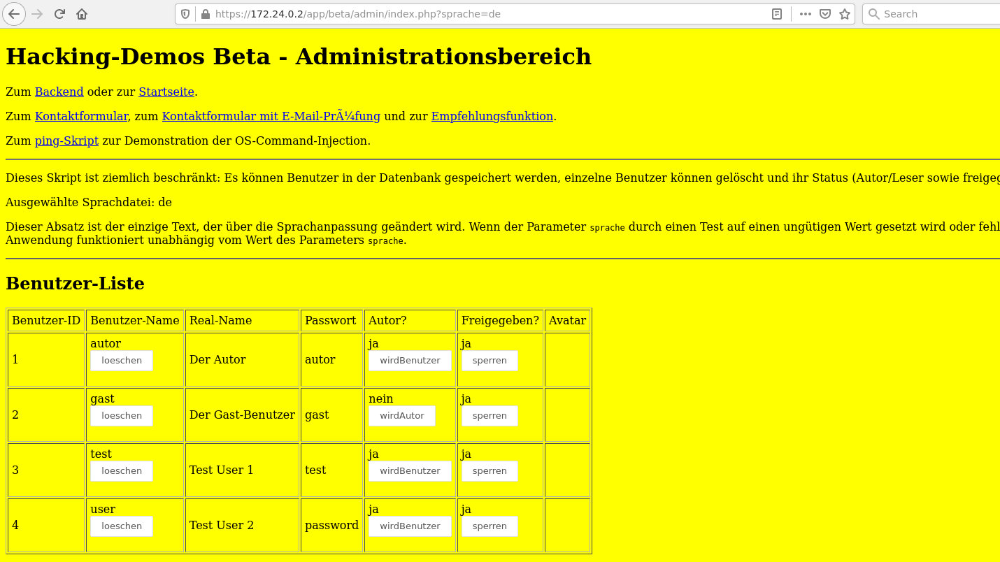
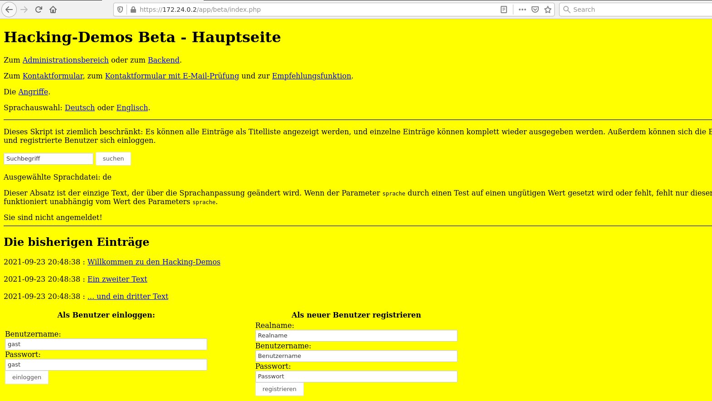
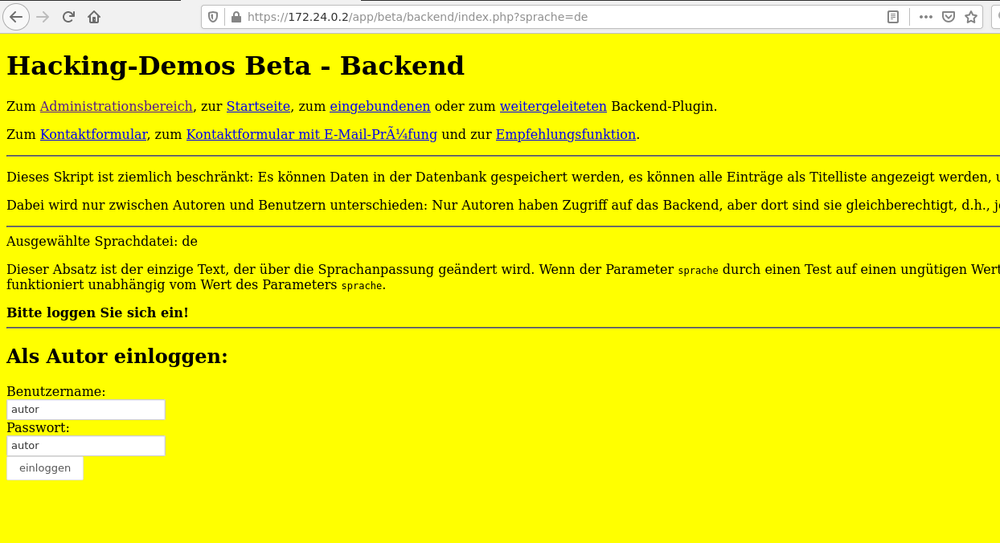
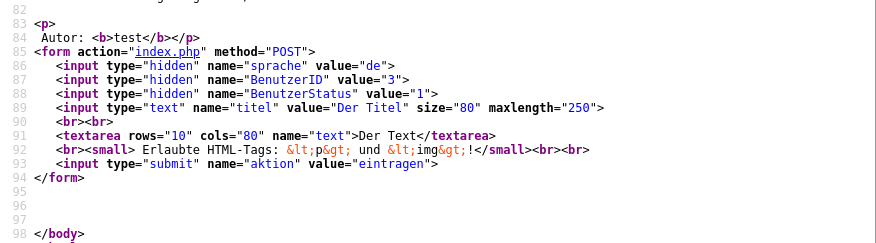

# Hidden Input Fields

## Introduction
[A hidden field allows to include data that cannot be seen or modified by users when a form is submitted. A hidden field often stores what database record needs to be updated when the form is submitted][1]. Here's an example of a hidden input field:

```html
<input name="id" value="1234" type="hidden">        
```

From security perspecitve, hidden input fields can contain state information that is critical for the correct functionality of the web application. Because hidden input fields can be easily manipulated using a proxy like ZAP or web developer tools in the web browser, they represent a potential security vulnerability.

## Detection
`grep` your web applications's source code for hidden input fields and test whether the application's behavior changes when you change the values of these hidden input fields.

A classical anti-pattern &mdash; luckily not so common anymore &mdash; is to use hidden input fields for storing item prices in a web shop. Another example is storing user's status, e.g., whether the user is signed in or just a guest, or whether the user is an an administrator or just a standard user.

## Defense
From the security perspective, the underlying problem with hidden input fields is that the state information is stored **on the client**, where it is easy to manipulate.

The main defense philosophy &mdash; as with numerous other web security threats &mdash; is to **never trust the client**. Any critical information used by your web app must be stored on the server. Values received from the client must always be checked & validated (if possible). 

If values must be stored on the client (e.g., session IDs), they should be encrypted or hashed to make their manipulation harder.

## Demo
[Start Docker containers with `docker-compose up`, start ZAP session, update ZAP, download and import SSL certificate, navigate to the vulnerable web application, and run `install.php` to populate the database][2].

Click on "Administrationsbereich" to get to:



While this would be conceiled 

Navigate to `app/beta/index.php` and click on "Backend":



That brings you to:



Next, log in as user `test` with password `test`:


Once you're loged in, you can create a new entry:


View the source code of the page you're currently logged in and you'll see that it contains hidden input fields:




[1]: https://www.w3schools.com/tags/att_input_type_hidden.asp
[2]: start-docker-containers.md