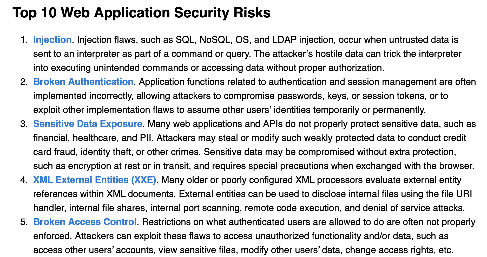

## Finding Vulnerabilities in Web Applications
In a nutshell, **to find vulnerabilities** in your web application, you need to:
* **test** various values for **parameters** used by the web application and see what happens (conceptually similar to fuzzing)
* **check** web application **code for bugs** that may lead to security vulnerabilities (typically missing checks of input values or missing countermeasures against certain types of attacks)

## OWASP TOP 10
The [Open Web Application Security Project (OWASP)](https://owasp.org/www-project-top-ten/) maintains a list of Top 10 vulnerabilities in web applications.

## Naming Conventions
In cryptographic literature, e.g., the seminal [Handbook of Applied Cryptography](https://cacr.uwaterloo.ca/hac/), you will typically find the following naming conventions: 
* **Alice**, **Bob** are legitimate users
* **Eve** is a malicious user, i.e., the attacker

In the context of these write-ups:
* **Server** is the web server running the web application
* **Client** is the web browser (or the computer running a web browser)