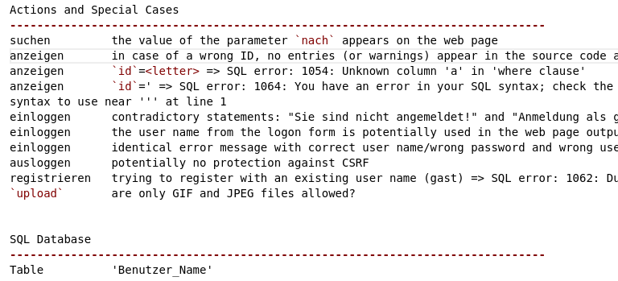

# Reconnaissance

## Introduction
**reconnaissance**: *n*. 1. Military observation of a region to locate an enemy or ascertain strategic features. 2. Preliminary surveying or research.

Why Reconnaissance? Consider the anatomy of a typical cybersecurity attack!

## Kill Chain
The term [kill chain](https://en.wikipedia.org/wiki/Kill_chain) was originally coined by the military to describe the **structure of an attack**:
* Finding adversary targets suitable for engagement,
* Fixing their location,
* Tracking and observing,
* Targeting with a suitable weapon or asset to create desired effects,
* Engaging the adversary, and
* Assessing the effects.

In 2011, Hutchins et al [1] from Lockheed-Martin expanded this concept to an **intrusion kill chain** for (network) security. They defined intrusion kill chain as:
* Reconnaissance,
* Weaponization,
* Delivery,
* Exploitation,
* Installation,
* Command and control (C2), and 
* Actions on objectives. 

Later on, security organizations have adopted this concept under the name **cyber kill chain**.

## Intrusion Kill Chain
The intrusion kill chain consists of the following phases:

Source: [Wikimedia Commons](https://commons.wikimedia.org/wiki/File:Intrusion_Kill_Chain_-_v2.png)

## Mimick the Attacker
Every attack starts by collecting information about the target, e.g., a web application. This is the first step in the cyber kill chain.

Likewise, to test a web application for security vulnerabilities, you must first get to know it. Among other things:
* You must understand what functions it uses and what parameters these functions have.
* You have to test every parameter and determine whether it can be exploited (e.g., using illegitimate values).
* You need to check whether the web application code contains known vulnerabilities.

**Systematic collection and documentation** allows you to understand what a real attacker would learn and where she could break your application's security.

## Collect Rudimentary Information
Document any **easy-to-spot hints** to security vulnerabilities:
* Suspicious comments in the HTML code like `<!-- default password: ...`
* Sensitive information embedded in the HTML code
* Error messages from the web application
* Error messages from the web server and HTTP responses

## Learn the Web Application's Structure
Catalogue **all pages, resources and parameters** that belong to or are used by the web application:
* Using a general-purpose tool like [wget](https://www.gnu.org/software/wget/)
* Using a special-purpose tool like [OWASP Zed Attack Proxy (ZAP)](https://www.zaproxy.org/) crawler
* By manually visiting all web pages of the application (works well for small web applications)

While `GET` parameters are displayed in the URL, you'll need a web proxy like ZAP to access `POST` parameters and cookies.

If your web application has different roles (guest, admin, ...), you'll have to test it for all these roles (i.e., first as a guest, then logged in as admin, etc.)

## Investigate Individual Web Pages
Visit all pages and **inspect their source code**. Look for things like:
* **Leaky HTML comments** containing e.g., code fragments, configuration parameters, server names, SQL table descriptions, etc.
* **Hidden input fields** (`<input type='hidden' ...>`)
* **SQL queries** printed in the page source due to programming or configuration errors (reveal the structure of the database and the queries used)
* **IP addresses of internal servers**
* **Web or email addresses**, e.g., email addresses of the developers. These might reveal who wrote the application. Maybe it's just an optical tweak of a well-known web app?

## Investigate Parameters
Investigate **all parameters** passed to the application:
* What happens when you change their values or use invalid values, e.g., a string instead of an integer?
* Do invalid parameters return error message that leak information about the application like database table names?

## Collect More Information
* Are there unlinked resources likes directories or files?
* For instance, if there are links to files financial-report18.pdf and financial-report19.pdf, is there an unpublished file financial-report20.pdf?
* Are there any hints to the structure of file names or sub directories?
* As an example, if the web application contains user profiles, is it possible to access an arbitrary profile using `user-<number>.html` or `user.php?id=<number>`?
* Are there unlinked sub-directories like `test/` or `admin/`?
* Does the web server contain unused libraries or example application code that contains hints to known vulnerabilities or the internals of the web application?
* What else is running on the server? Maybe SSH?

## Investigate Client-Side Code
One main difference between static web sites and client-side code: JavaScript (JS) is **stateful**. As a result, the **order** of user interactions can change the outcome of running the JS code.

Investigate **what input parameters are sanitized** in the client-side code (JS or plain HTML).

## Investigate Client-Side Code: Static Pages
If user input is checked, i.e., sanitized, at client side (either in JavaScript or in HTML), chances are that no sanitization is implemented on the server. 
    
Because an attacker can easily manipulate the client-side code, she can manipulate the user inputs sent to the server.

Check \textbf{all input fields} like text input, drop-down menus, radio buttons and select tags for \textbf{constraints for their values}. E.g., is there a maximum text length for a text field? Are numeric input values scoped? If yes, change these values and check how the web application is behaving.

There are 3 ways to change the client-side values:
* Parameters transmitted via `GET` requests can be manipulated directly in the URL
* Parameters transmitted via `POST` requests can be manipulated directly in a local copy of the website code
* On the fly, using a proxy like the [OWASP ZAP](https://www.zaproxy.org/) or web developer tools in the web browser

Hidden forms `type="hidden"` are sometimes used to store values used by the web application. A classic mistake is to store the price of the items in a web shop application (since you can easily manipulate them before sending them to the server).

### A Trivial Example
Say there is a drop-down menu to select the number of items to be added to a shopping cart. The drop-down menu allows numbers in the range 0 to 100. What happens when you set this parameter to a negative value and transmit it to the server?
    
Maybe there is no sanitization on the server side because only values greater or equal to zero can be selected from the drop-down menu? In this case, the final price is calculated by multiplying the price of the item with a negative number.

## Collecting JavaScript-related Information
After checking HTML, next step is to check the JavaScript code:
* Is JavaScript used to validate input data? If so, maybe the check on the server side is omitted.
* What files and scripts are being loaded? Any known vulnerabilities?
* Are there vulnerabilities in the JavaScript program logic itself? Any logic flaws that can be exploited?

## Reconnaissance of the Demo Application

## References
1. Hutchins, Eric M and Cloppert, Michael J and Amin, Rohan M and others *Intelligence-Driven Computer Network Defense Informed by Analysis of Adversary Campaigns and Intrusion Kill Chains*, Leading Issues in Information Warfare & Security Research, 2011