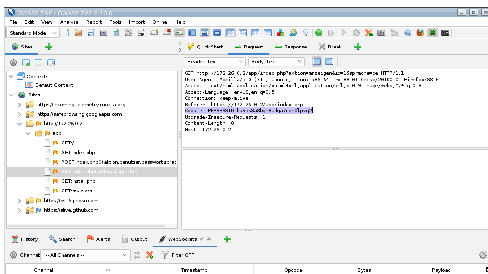

# Session Hijacking

## Introduction
Various attacks on web applications can be mitigated by storing state information on the server (instead of client). In that case, the web application needs a way to identify the user.

The notion of a **session** is used to associate state information (stored on the server) to a specific user. The web application assigns each session a unique **session identifier** (session-ID).

A session-ID is a number or a combination of numbers and letters that uniquely identifies a session. The session-ID is assigned to the client (user agent) upon the first HTTP request to the web application. Every subsequent request carries the session-ID so that the web application can identify the client (user) and retrieve the corresponding state information stored on the server.

Because the session-ID must be stored on the client, it can be manipulated or stolen. An attack exploiting this vulnerability is referred to as **session hijacking**. In this case, Eve gets hold of the session-ID information to gain unauthorized access to the web application.


A special case of session hijacking is the so-called **authorization bypass**. Example: web application identifies the client (user agent) based on a cookie containing the user name, the user ID and the date of the last session. This could look something like this:

```
Name=Alice
userID=1234
last=2021-08-24
```

Is there are user with ID 1235? If Eve gets hold of the cookie, she can alter `userID` and use the manipulated cookie to take on the identity of another user.

## Detection
First, you need to identify potential session-IDs in the web application. You need to inspect the web application's source code. As a shortcut, you can search for parameters whose names contain `ID`, `TOKEN`, `SESSIONID` or similar strings. These parameters can be located in hidden input fields, URL parameters or in cookies.

Once you identified a potential session-ID, **change** it and **check** whether you can impersonate another user.

## Defense
Session hijacking requires a valid session-ID. Eve has essentially 4 options to get hold of it:
* Cross-site-scripting (XSS): XSS attacks are commonly used to steal cookies (more on this later). Make sure your web application has no XSS vulnerabilities. In addition, you can set `HTTPOnly` flag to prevent access to cookies from within JavaScript
* Eavesdropping network traffic: if Eve can read network traffic between the client and the web application, she can extract the session-ID. Ensure that you web application uses TLS (HTTPS)
* Searching logfiles: if Eve has access to the web server (or proxy) logfiles, she can search them for session-IDs that were transmitted via `GET` requests. Session-ID should therefore be transmitted in cookies or via `POST` requests
* Brute-force attack: Eve can try to guess the format of your session-IDs and try out various (random) combination until she finds a valid session-ID. You should use large random values as session-IDs

Performing session identification based on the **combination** of the session-ID and the IP address of the client makes session hijacking more difficult. Instead of the IP address, you can also use e.g., the `User-Agent` header (i.e., user the client browser "model" as an additional identification factor). 

To reduce session hijacking-related risks, you should end the sessions **after a specific time** and make the corresponding session-IDs **invalid**. This can be done using a "hard" time-out (e.g., every session ends after 30 minutes) or a "soft" time-out (e.g., session ends after 10 minutes of inactivity).

## Demo
Open a new tab in your web browser and visit `app/index.php` and login as `gast`/`gast`. Switch to ZAP, activate the breakpoint, go back to the web browser and click on any link (e.g., show the first text entry). Switch back to ZAP and read off the session ID:



In my experiment, session ID for user `gast` is:

```
Cookie: PHPSESSID=hk95s8a8bgm8adga7noh0lpvq2
```

Now open a new **private** window (the private mode will prevent your browser from accessing the cookie set by the vulnerable web application in the other session). In the private window, visit `app/index.php` and login as `test`/`test`. Switch to ZAP, activate the breakpoint, an click on any link (e.g., show the second text entry) in the private window. Switch back to ZAP and read off the session ID:


In my case, the session ID for user `test` is:

```
Cookie: PHPSESSID=p5isragibi89mfhv66h4imcbc3
```

Now activate ZAP breakpoint again. Go to the **first** web browser window (where you are logged in as user `gast`) and click on any link (e.g., show second text entry). In ZAP, replace `PHPSESSID` with that of the user `test` (in my case, it's `p5isragibi89mfhv66h4imcbc3`):  


Now resume the HTTP request in ZAP and switch back to the **first** web browser window. Recall that you were logged in as user `gast` in this window. By replacing the `PHPSESSID` cookie value with that of user `test` you hijacked the session:


