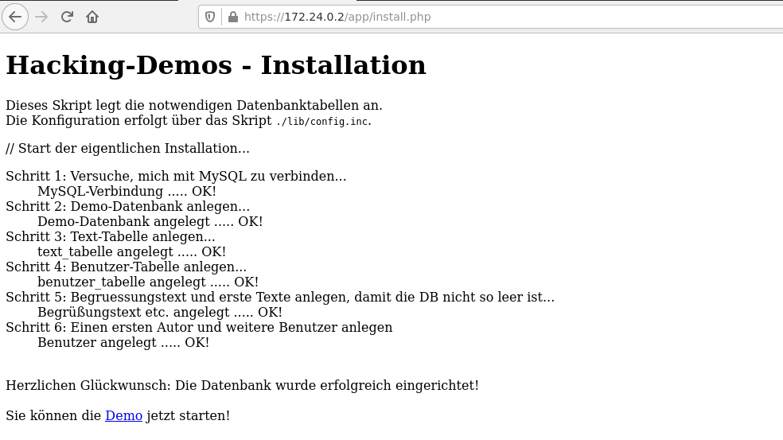
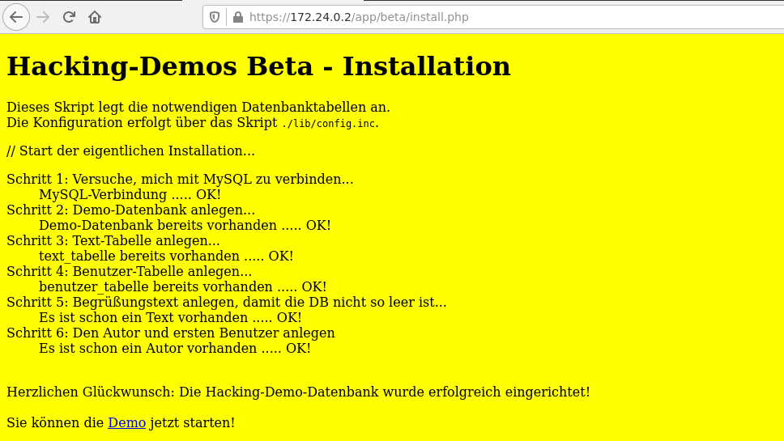

`cd` to the `Docker` subdirectory and issue `docker-compose up`:

```bash
$ youve-been-hacked/Docker$ docker-compose up
Creating docker_zap_1     ... done
Creating docker_vulnapp_1 ... done
Attaching to docker_zap_1, docker_vulnapp_1
vulnapp_1  |  * Starting web server apache2
zap_1      | Using ZAP command line options: -host 0.0.0.0 -port 8090
vulnapp_1  | AH00558: apache2: Could not reliably determine the server's fully qualified domain name, using 172.21.0.2. Set the 'ServerName' directive globally to suppress this message
vulnapp_1  |  * 
vulnapp_1  |  * Starting MySQL database server mysqld
vulnapp_1  |    ...done.
vulnapp_1  |  * Checking for tables which need an upgrade, are corrupt or were 
vulnapp_1  | not closed cleanly.

```

Open your web browser and navigate to `http://127.0.0.1:8080/zap/`. This will start the ZAP proxy:


Choose to **not** persist the session:


Update all packages:


Look up the IP address of the `docker_vulnapp_1` container running the vulnerable web application:

```bash
$ youve-been-hacked/Docker$ docker container inspect docker_vulnapp_1 
[
    {
        "Id": 

-- snip --

            "Networks": {

-- snip --

                    "IPAddress": "172.21.0.2",

-- snip --

            }

-- snip --

    }
]
```

Look up the IP address of the ZAP Docker container and the port (8090) in the lower left corner: 


Next, download ZAP's dynamic SSL certificate. Go to Options and click on "Save":


Switch to your web browser and import ZAP's SSL certificate:


In your web browser, configure the proxy to match the ZAP IP address and port:


Navigate to `http://<docker_vulnapp_1 IP address>/app/install.php` to populate the vulnerable web application's database:



Navigate to `http://<docker_vulnapp_1 IP address>/app/beta/install.php` to populate the beta version of the vulnerable web application's database:



And now [use the source][1], 

```
88                                88                              
88                                88                              
88                                88                              
88,dPPYba,  ,adPPYYba,  ,adPPYba, 88   ,d8  ,adPPYba, 8b,dPPYba,  
88P'    "8a ""     `Y8 a8"     "" 88 ,a8"  a8P_____88 88P'   "Y8  
88       88 ,adPPPPP88 8b         8888[    8PP""""""" 88          
88       88 88,    ,88 "8a,   ,aa 88`"Yba, "8b,   ,aa 88          
88       88 `"8bbdP"Y8  `"Ybbd8"' 88   `Y8a `"Ybbd8"' 88      
```


[1]: https://ascii.co.uk/art/hacker