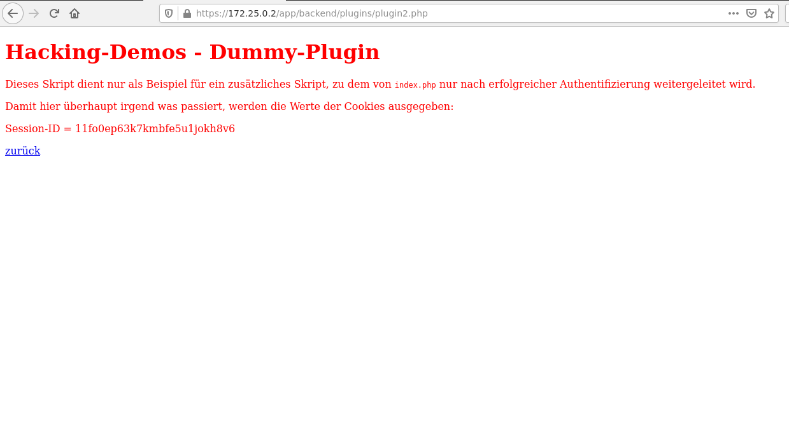
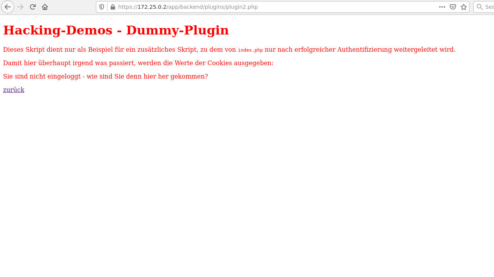

# URL Jumping

## Introduction
Eve abuses the **intended sequence** of web pages to access functions that by design must be unavailable at that point in time.

## Example
Eve tries to identify URLs that must be called in a specific sequence and tries to manipulate this sequence.

In a web shop, the intended sequence of transactions &mdash; i.e., pages that a shop's customer visits &mdash; could look something like this:

1. Search for a suitable product at `catalogue.php` add an article to the shopping cart at `add.php` 
2. Verify the customer order at `order.php`
3. Provide shipping information (customer's postal address) at `shipping.php`
4. Enter credit card information at `payment.php`
5. Checkout \& finish the order at `checkout.php`

If Eve can jump from step 4 directly to step 6, she might be able to order an item without paying for it.

## Detection
Make a complete list of URLs in your web application and whether certain URLs must be called in a specific order. Use information gathered during recon phase.

For every URL sequence:
* Call the URLs in the intended order and document the parameters passed to the web application
* Diverge from the intended sequence and see what happens. Are there any error messages (e.g., "You first must create a user") or are specific URL/pages not accessible?
* If there is no error message and the URLs can be accessed in any order, check whether this represents an actual, exploitable vulnerability

## Defense
URL jumping is a security issue only when the sequence in which URLs are accessed is relevant for the web application.

In that case, you need to check that the correct sequence is used, e.g., `checkout.php` would check if the user previously visited `payment.php` which, in turn, would check if the user previously visited `shipping.php`.

In theory, there are 3 ways to identify a previously visited URL:
1. The URL (or the corresponding ID) is stored in a hidden input field or in an URL parameter
2. The URL (or the corresponding ID) is stored in a cookie
3. The URL, from which the user is allegedly coming, is compared to the `Referer` field value in the HTTP header

Unfortunately, option 1 (hidden input field) and option 2 (cookie) since Eve can be easily manipulate them. That leaves us with option 3 (`Referer`).

An HTTP request could look like this:
```
GET /checkout.php HTTP/1.1
Host: www.shop.xyz
User-Agent: Mozilla/5.0 (Macintosh; U; PPC Mac OS X; de-d[...]
Accept: */*
Accept-Encoding: gzip, deflate
Accept-Language: de-de
Connection: keep-alive
Referer: https://www.shop.xyz/payment.php
```

The `Referer` value is automatically set by the web browser. In case of a bookmark or a direct entry in the web browser's address field the `Referer` value does not exist in the HTTP header.

However, the `Referer` value can be omitted by the web browser (for privacy reasons), removed from the HTTP request by a proxy or manipulated by Eve.

`Referer` value can be manipulated using a tool like ZAProxy or using a dedicated client where the individual values of the HTTP header can be defined manually. Thus, `Referer` is also **insecure**.

In the end, the only effective defense against URL jumping &mdash; similar to other attacks &mdash; is to store state information on the server.

Specifically, the information about the visited URLs for each user can be stored temporarily in the web application (or persistently in a database).

## Demo


From the root `app/index.php` of the vulnerable web app, you can go to `admin/index.php` and `backend/index.php`. From `backend/index.php` you can go to `backend/plugins/plugin2.php`.

Hence, you need to test whether it is possible to jump to `backend/plugins/plugin2.php` **without** visiting `backend/index.php` first.

To do this, you first login as at `index.php`:


Next, visit `app/backend/plugins/plugin2.php`:



This is a test script showing you your current session ID. This way, you know you're logged in. 

Now go back to `app/index.php`, logout and call `app/backend/plugins/plugin2.php` again:



As you can see, the web application distinguishes between a user that is logged in and a user that is not logged in. Consequently, URL `app/backend/plugins/plugin2.php` is not susceptible to URL jumping.
