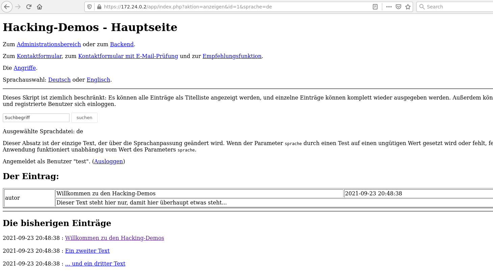
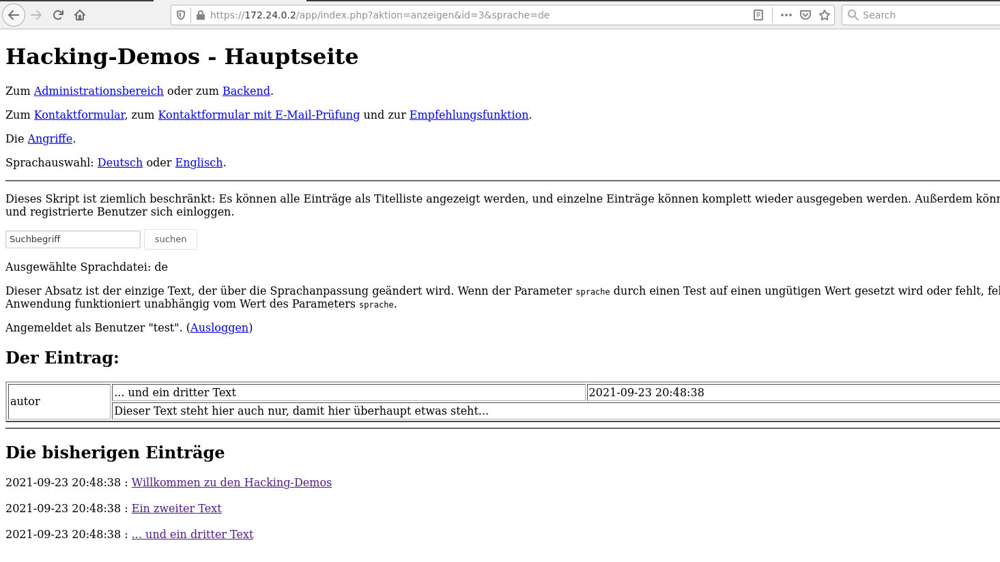
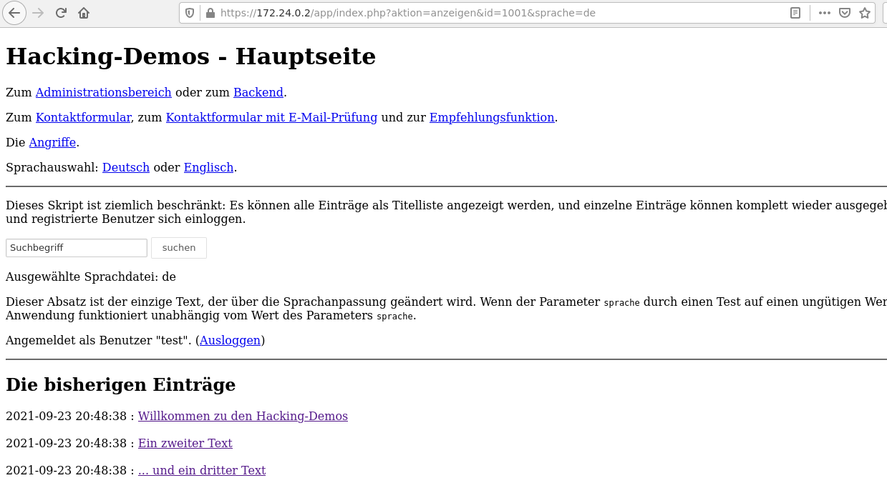

# URL Parameters

## Introduction
URL parameters are used to transmit information in the URL, e.g., state information. In contrast to forms, transmitting information via URL parameters does not require clicking a submit button.

## Detection
Using URL parameters to transmit information poses a security risk, because it is trivial to manipulate these parameters. To identify vulnerabilities:
* Look for URL parameters identified during the recon phase
* Investigate what happens when you change these parameters. Does this cause an unexpected and unintended change of the state of the web application?

As an example, image you have this URL: `http://www.webapp.example/editprofile.php?id=123`:
* What happens when you change `id`? Can you edit the profile of a different user?
* Are there (hidden) parameters to activate debug information, e.g., `debug=on`, `debug=1` or `debug=true`?

## Defense
The core security issue with URL parameters is that the (state) information is stored **on the client** where it can be easily manipulated.

URL parameters must be therefore always be checked & validated. If possible, they should be encrypted or hashed.

## Demo
What URL parameters does the vulnerable web application use? As documented in [RECON.md](../01-recon/RECON.md), `app/index.php` script uses the following URL parameters:

```
URL parameters in index.php:
----------------------------------------------------------------------------
Select language:
  sprache=de
  sprache=en

Select entry:
  aktion=anzeigen&id=1&sprache=de
  aktion=anzeigen&id=2&sprache=de
  aktion=anzeigen&id=3&sprache=de
```

The `aktion` parameter clearly identifies the function to be called (`anzeigen` apparently is for displaying content). The `id` parameter probably selects the text entry to be displayed. The `sprache` parameter defines the language to be used.

If you go to `app/index.php` and select a text entry:


You'll see the URL parameters passed to the web server:



What happens when you manipulate the `id` URL parameter? 



A different text is displayed, but this is not a security vulnerability (Eve could have simply clicked on text 3 in `app/index.php`).

What happens when you entered an unlisted `id` value, e.g., 1001?



You should also try values 0 and -1 as well as values in between, e.g., 10, 15, 20, etc.

Now try something different: instead of entering a numerical value for `id`, try a string like `abcd`:


There's something interesting here. For the value `abcd` the web server returns an SQL error

```
Fehler beim Holen des Eintrags:
1054: Unknown column 'abcd' in 'where clause'
```

That's an indication where to look for an SQL injection vulnerability. 


